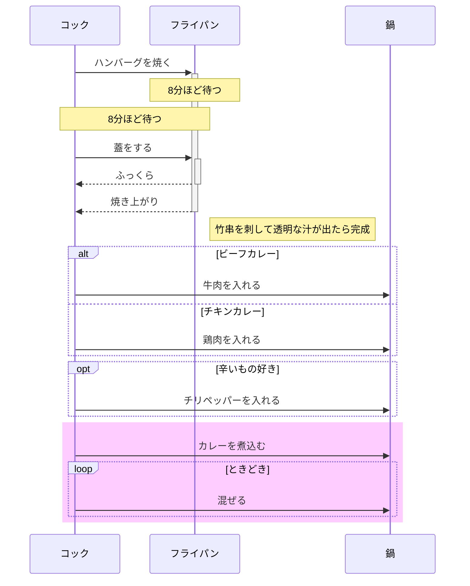
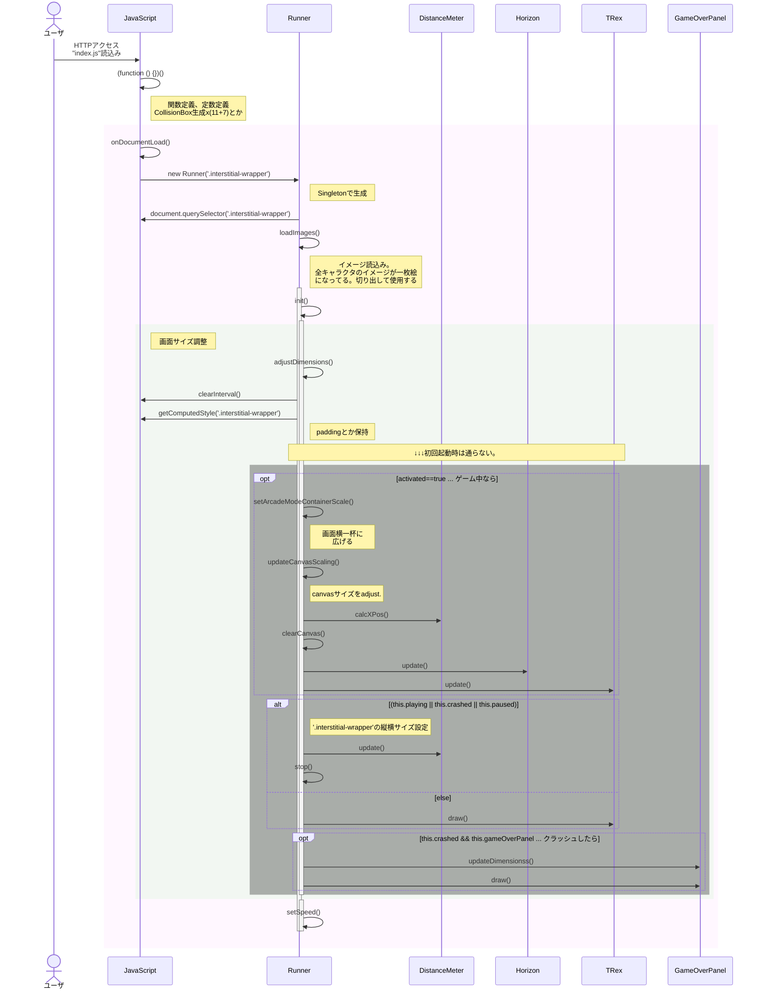

# t-rex-runner

JavaScriptのゲームプログラム

[wayou](https://github.com/wayou/t-rex-runner)さんのソースで練習させてもらいました。  
GameEngineを全く使わず、純粋HTML/CSS/JSでの実装なのでかなり勉強になりました。  
実はまだ、理解できてないので、シーケンス図を作成して理解を深める予定。

wayouさん、ありがとうございます。

## シーケンス

