# t-rex-runner

JavaScriptのゲームプログラム

[wayou](https://github.com/wayou/t-rex-runner)さんのソースで練習させてもらいました。  
GameEngineを全く使わず、純粋HTML/CSS/JSでの実装なのでかなり勉強になりました。  
実はまだ理解できてないので、シーケンス図を作成して理解を深める予定。

wayouさん、ありがとうございます。

## シーケンス

### 初期化

```mermaid
sequenceDiagram
actor user as ユーザ
participant js as JavaScript
participant runner as Runner
participant distanceMeter as DistanceMeter
participant horizon as Horizon
participant horizonLine as HorizonLine
participant cloud as Cloud
participant nightMode as NightMode
participant tRex as TRex
participant gameOverPanel as GameOverPanel

user ->> js: HTTPアクセス<br/>"index.js"読込み
js ->> js: (function () {})()
Note right of js: 関数定義、定数定義<br/>CollisionBox生成x(11+7)とか
rect rgba(255, 0, 255, 0.03)
  js ->> js: onDocumentLoad()
  js ->> runner: new Runner('.interstitial-wrapper')
  Note right of runner: Singletonで生成
  runner ->> js: outerContainerEl = document.querySelector('.interstitial-wrapper')
  runner ->> runner: dimensions=Runner.defaultDimensions(600x150)
  runner ->> runner: loadImages()
  Note right of runner: イメージ読込み。<br/>全キャラクタのイメージが一枚絵<br/>になってる。切り出して使用する
  %% --------------- Runner::init() {
  activate runner
    runner ->> runner: init()
    %% --------------- Runner::adjustDimensions() {
    activate runner
      rect rgba(0, 255, 0, 0.05)
        Note right of js: 画面サイズ調整
        runner ->> runner: adjustDimensions()
        runner ->> js: clearInterval()
        runner ->> js: getComputedStyle('.interstitial-wrapper')
        Note right of runner: paddingとか保持
        Note right of runner: this.dimensions.WIDTHを更新
        Note over runner, gameOverPanel: ↓↓↓初回起動時は通らない。
        rect rgba(0, 0, 0, 0.3)
        opt activated==true ... ゲーム中なら
          runner ->> runner: setArcadeModeContainerScale()
          Note right of runner: 画面横一杯に<br/>広げる
          runner ->> runner: updateCanvasScaling()
          Note right of runner: canvasサイズをadjust.
          runner ->> distanceMeter: calcXPos()
          runner ->> runner: clearCanvas()
          runner ->> horizon: update()
          runner ->> tRex: update()
        end
        alt (this.playing || this.crashed || this.paused)
          Note right of runner: '.interstitial-wrapper'の縦横サイズ設定
          runner ->> distanceMeter: update()
          runner ->> runner: stop()
        else else
          runner ->> tRex: draw()
        end
        opt this.crashed && this.gameOverPanel ... クラッシュしたら
          runner ->> gameOverPanel: updateDimensionss()
          runner ->> gameOverPanel: draw()
        end
      end
    deactivate runner
    %% } // --------------- Runner::adjustDimensions()
    end

    %% --------------- Runner::setSpeed() {
    activate runner
      runner ->> runner: setSpeed()
    deactivate runner
    %% } // --------------- Runner::setSpeed()

    runner ->> runner: this.containerEl=createElement('div')
    runner ->> js: createCanvas(this.containerEl, 600x150)
    Note right of runner: 生成canvasをthis.containerElの子に.
    Note right of runner: this.canvasCtxを初期化
    runner ->> runner: updateCanvasScaling(this.canvas)
    Note right of runner: this.canvasサイズをadjust.

    runner ->> horizon: this.horizon = new Horizon(this.canvas, this.spriteDef, is.dimensions, 0.6/*←なんかの係数*/)
    Note over horizon: 障害物object,nightMode,cloud,horizonLineを持つ
    rect rgba(0, 255, 0, 0.05)
      horizon ->> horizon: init()
      activate horizon
        horizon ->> horizon: addCloud()
        %% --------------- Horizon::init() {
        activate cloud
          horizon ->> cloud: new Cloud(this.canvas, this.spritePos.CLOUD, this.dimensions.WIDTH)
          rect rgba(0, 0, 255, 0.05)
            cloud ->> cloud: init()
            activate cloud
              cloud ->> cloud: draw()
              cloud ->> js: CanvasRenderingContext2D::drawImage()
              cloud ->> js: CanvasRenderingContext2D::restore()
              Note right of horizonLine: 雲を描いてる
            deactivate cloud
          end
        deactivate cloud
        %% } // --------------- Horizon::init()
        %% --------------- horizonLine::HorizonLine() {
        activate horizonLine
          horizon ->> horizonLine: new HorizonLine(this.canvas, this.spritePos.HORIZON)
          rect rgba(0, 0, 255, 0.05)
            horizonLine ->> horizonLine: setSourceDimensions()
            horizonLine ->> horizonLine: draw()
            horizonLine ->> js: CanvasRenderingContext2D::drawImage()
            horizonLine ->> js: CanvasRenderingContext2D::drawImage()
            Note right of horizonLine: 水平線を描いてる
          end
        deactivate horizonLine
        %% } // --------------- horizonLine::HorizonLine()
        %% --------------- NightMode::NightMode() {
        activate nightMode
          horizon ->> nightMode: new NightMode(this.canvas, this.spritePos.MOON, this.dimensions.WIDTH)
          rect rgba(0, 0, 255, 0.05)
            nightMode ->> nightMode: placeStars()
            Note right of horizonLine: 星、描いてない!!
          end
        deactivate nightMode
        %% } // --------------- NightMode::NightMode()
      deactivate horizon
    end

    %% --------------- DistanceMeter::init() {
    activate distanceMeter
      runner ->> distanceMeter: this.distanceMeter = new DistanceMeter(this.canvas, this.spriteDef.TEXT_SPRITE, this.dimensions.WIDTH)
      Note over distanceMeter: DistanceMeterは<br/>高得点Top5表示もしている。
      rect rgba(0, 0, 255, 0.05)
        distanceMeter ->> distanceMeter: init()
        activate distanceMeter
          distanceMeter ->> distanceMeter: calcXPos()
        deactivate distanceMeter
      end
      Note over distanceMeter: ここではまだ描かない!!
    deactivate distanceMeter
    %% } // --------------- DistanceMeter::init ()

    %% --------------- TRex::init() {
    activate distanceMeter
      runner ->> tRex: this.tRex = new Trex(this.canvas, this.spriteDef.TREX)
      rect rgba(0, 0, 255, 0.05)
        tRex ->> tRex: init()
        activate tRex
          activate tRex
            tRex ->> tRex: draw()
            Note over tRex: リソース切り出し位置を計算
            tRex ->> js: CanvasRenderingContext2D::drawImage()
            Note right of tRex: 主人公を描いてる
          deactivate tRex
          activate tRex
            tRex ->> tRex: update(0, Trex.status.WAITING)
            opt 状態更新フラグに設定あり
              Note over tRex: 内部値更新
              opt 状態更新フラグが<br/>Trex.status.WAITING
                tRex ->> tRex: setBlinkDelay()
                Note right of tRex: 時間設定し直してるだけ
              end
            end
            alt (this.status == Trex.status.WAITING)
              tRex ->> tRex: blink()
              Note right of tRex: 一定時間経過してたら、目を瞬かせる
              tRex ->> js: CanvasRenderingContext2D::drawImage()
              tRex ->> tRex: setBlinkDelay()
            else Trex.status.WAITING以外
              tRex ->> js: CanvasRenderingContext2D::drawImage()
              Note right of tRex: 主人公を描く
            end
            opt 主人公しゃがみ==true
              tRex ->> tRex: setDuck(true)
              alt (isDucking && this.status != Trex.status.DUCKING)
                tRex ->> tRex: update(0, Trex.status.DUCKING)
              else (this.status == Trex.status.DUCKING)
                tRex ->> tRex: update(0, Trex.status.RUNNING)
              end
              Note right of tRex: 主人公を描いてる
            end
          deactivate tRex
        deactivate tRex
      end
    deactivate distanceMeter
    %% } // --------------- TRex::init ()

    runner ->> runner: this.outerContainerEl.appendChild(this.containerEl)
    Note right of runner: 生成したthis.containerElをouterContainerElの子に.

    opt スマホなら
      runner ->> runner: createTouchController()
      Note right of runner: 空div要素を生成してouterContainerElの子に。
    end

    runner ->> runner: startListening()
    rect rgba(0, 0, 255, 0.05)
      activate runner
        runner ->> js: addEventListener(KEYDOWN, this)
        runner ->> js: addEventListener(KEYUP, this)
        alt スマホなら
          runner ->> js: addEventListener(TOUCHSTART, this)
          runner ->> js: addEventListener(TOUCHEND, this)
          runner ->> js: addEventListener(TOUCHSTART, this)
        else スマホ以外
          runner ->> js: addEventListener(MOUSEDOWN, this)
          runner ->> js: addEventListener(MOUSEUP, this)
        end
      deactivate runner
    end

    runner ->> runner: update()
    rect rgba(0, 0, 255, 0.05)
      activate runner
        runner ->> runner: clearCanvas()
        activate runner
          runner ->> runner: clearRect()
        deactivate runner
        opt ジャンプ中なら
          runner ->> runner: updateJump()
        end
      deactivate runner
    end
  deactivate runner

  runner ->> js: window::addEventListener('resize', debounceResize)

  %% } // --------------- Runner::init()
end
```

